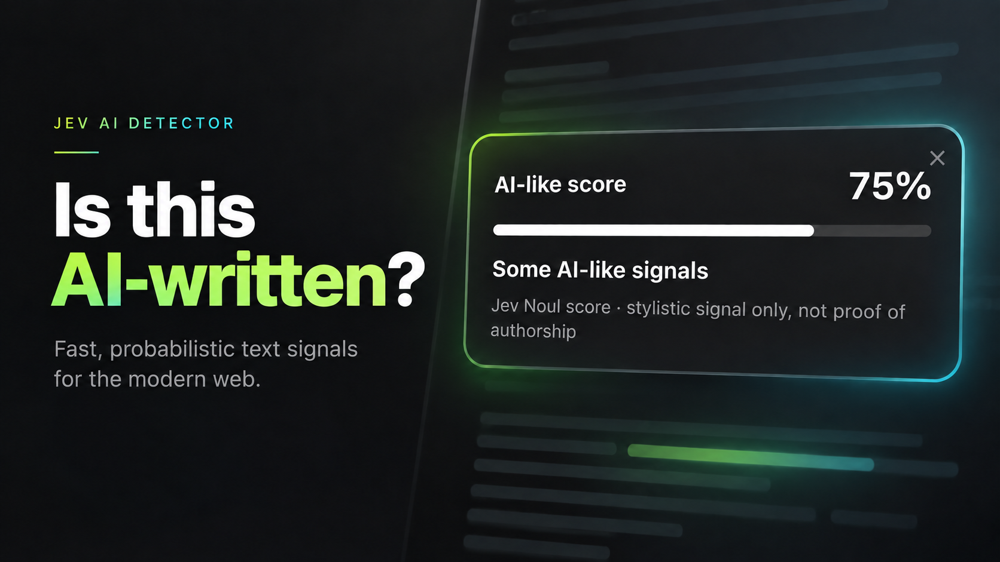

# Jev AI Detector — fast & ultra-light Chrome extension

Select text on a webpage. (TypeSafe's Jev)[https://typesafe.ai/] gives the **AI-like score**. 

## Install

1. Open `chrome://extensions`.
2. Turn on **Developer mode**.
3. Click **Load unpacked** and choose the `extension/` folder.
4. Open the extension's **Details → Extension options**.
5. Paste your TypeSafe API key and click **Save**.

No local Node server is required.

## Use

Select text on a normal webpage, then either:

- Right-click → **Check AI-like score with Jev**, or
- Press `Cmd+Shift+Y` on macOS / `Ctrl+Shift+Y` elsewhere.

## Security

The API key is stored in `chrome.storage.local` for this extension and is sent by the extension service worker directly to `https://api.typesafe.ai/`.

This is convenient for a personal demo, but it is **not the right architecture for a public extension**. Anyone who controls an extension can read any key the user gives that extension and can exfiltrate it. Only enter keys into extensions whose code/publisher you trust. Prefer a dedicated/revocable key with usage limits when the provider supports that.

## Important limitation

An AI-like score is not a reliable probability that text was AI-generated. Human and AI writing distributions overlap heavily, and edited/translated text makes attribution harder. Treat the output as an experimental stylistic signal, not evidence of authorship.
